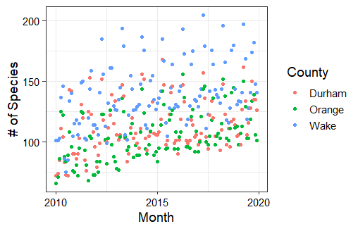
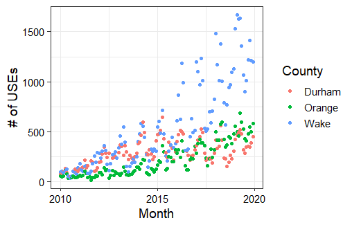

\newpage
\tableofcontents 
\newpage
\listoftables 
\listoffigures 
\newpage

```{r setup, include=F, echo=F, error=F, message=F, warning=F}
# Setting r chunk global settings 
knitr::opts_chunk$set(include=F, eval=F, echo=F, error=F, message=F, warning=F)

# Set your working directory
setwd("~/MEM Courses/Sem2/ENV 872/McCollum_Schoenecker_ENV872_EDA_FinalProject")
getwd()
# Load your packages
library(tidyverse); library(lubridate); library(sf); library(trend); library(zoo)
library(Kendall); library(tseries)

# Set your ggplot theme
mytheme <- theme_bw(base_size = 14) +
  theme(axis.text = element_text(color = "black"), 
        legend.position = "right")
theme_set(mytheme)

# Load your datasets
Durham.1 <- read.csv("./Data/Processed/tidy_Durham_2010-2014.csv")
Durham.2 <- read.csv("./Data/Processed/tidy_Durham_2015-2019.csv")
Orange.1 <- read.csv("./Data/Processed/tidy_Orange_2010-2014.csv")
Orange.2 <- read.csv("./Data/Processed/tidy_Orange_2015-2019.csv")
Wake.1 <- read.csv("./Data/Processed/tidy_Wake_2010-2014.csv")
Wake.2 <- read.csv("./Data/Processed/tidy_Wake_2015-2017.csv")
Wake.3 <- read.csv("./Data/Processed/tidy_Wake_2018-2019.csv")
counties_sf<- st_read('./Data/Raw/cb_2018_us_county_20m.shp') %>% 
  filter(NAME == "Durham"|NAME == "Orange"|NAME == "Wake") %>%
  filter(STATEFP == 37)
SGCN <- read.csv("./Data/Raw/xAPPENDIX-PA1-All-SGCN-by-taxonomic-group-2020-update_FINAL_v3.csv")
```


# Rationale and Research Questions
According to a 2019 study by Rosenberg et al, North America’s bird population has declined by 30% over the last fifty years. Many drivers are causing this steep decline, including the encroachment of human development into natural spaces as well as climate change. While this loss has occurred across habitat guilds and among both rare and common species, it also has important implications for the diversity of North America’s bird population as some species near extinction (Rosenberg et al 2019). Additionally, the phenomenon of urbanization itself often supports a less diverse population of generalist species as opposed to habitat specialists (Callaghan et al 2019). This reduction of biodiversity has negative consequences for the resiliency of natural ecosystems, as well as various ecosystem services (Şekercioğlu et al 2004).   

The Research Triangle region of central North Carolina is made up of some of the largest cities in the state, including Raleigh, Durham, and Cary. This region is characterized by mixed woodlands that support bird diversity (Minor and Urban 2010), and is currently experiencing rapid development (Doran and Golden 2016). In order to investigate changes in the diversity of the Research Triangle’s population during the past decade (2010-2020), we accessed open source eBird data from the three main counties that make up the region (Durham, Orange, and Wake counties) and analyzed them with time series methodology. In this analysis, we hoped to answer the following questions:   

1. How did the diversity of the Research Triangle’s bird population change over the 2010s?  

  1a. Is this change consistent across the three main counties in the Research Triangle (Durham, Wake, and Orange)?  

  1b. Was there a clear trend in the presence of species of concern across the decade?   

2. How did the popularity of eBird change in the Research Triangle over the 2010s?   

\newpage

# Dataset Information
eBird is an open-source citizen science website created by the Cornell University Lab of Ornithology which allows the public to upload their own bird observation data collected from around the world (eBird 2022). The site has become incredibly popular with both amateur birders and scientific researchers since its creation. We downloaded bird observation data from the site for Durham, Orange, and Wake counties collected between January 2010 and December 2019. The data includes many variables including the common and scientific names of each bird species and observation data, time, and geographic coordinates. However, several variables in the dataset were not of use to us, so we selected 12 variables from the original set to create new, tidy datasets for each county (Table 1). This wrangling was performed with v. 4.1 of the R programming language (R Core Team 2021) as well as the tidyverse package (Wickham et al 2019).  

**Column Name** | **Summary**
------------- | -------------
X | Row number 
------------------- | ---------------------------
COMMON.NAME | Primary English common name of the bird identified. 
------------------- | ---------------------------
OBSERVATION.COUNT | The number of individuals at the time of observation. An 'X' is used when no count was made, to indicate presence. 
------------------- | ---------------------------
COUNTY | What county the observation was made in (Durham, Orange, or Wake). 
------------------- | ---------------------------
LOCALITY | The location name for the observation. These can be chosen from a list or the observer can name the location. 
------------- | -------------
LOCALITY.ID | Unique alphanumeric code for a location.
------------- | -------------
LOCALITY.TYPE | Code defining the type of location: plot specific locations on a map (P), choose existing locations from a map (H), or choose to submit data for a town (T), postal code (PC), county (C), or state (S).
------------- | -------------
LATITUDE |  Latitude of the observation in decimal degrees.
------------- | -------------
LONGITUDE | Longitude of the observation in decimal degrees.
------------- | -------------
OBSERVATION.DATE | Date of observation
------------- | -------------
TIME.OBSERVATIONS.STARTED | What time did the observer start their sampling event (24 hour time)
------------- | -------------
OBSERVER.ID | The unique identification number given to a citizen observer. 
------------- | -------------
SAMPLING.EVENT.IDENTIFIER | The unique number associated with the sampling event; a combination of location, date, observer, and start time. 

Table: Descriptions of the 12 variables selected for analysis within the eBird datasets.

```{r Prelim Wrangling, eval=F}
# Wranging eBird Durham County raw data
Durham.1 <- read.csv("./Data/Raw/eBird_Durham_2010-2014.csv")
Durham.2 <- read.csv("./Data/Raw/eBird_Durham_2015-2019.csv")

Durham.1 <- Durham.1 %>%
  select(COMMON.NAME, OBSERVATION.COUNT, COUNTY, LOCALITY:SAMPLING.EVENT.IDENTIFIER)
Durham.2 <- Durham.2 %>%
  select(COMMON.NAME, OBSERVATION.COUNT, COUNTY, LOCALITY:SAMPLING.EVENT.IDENTIFIER)

# write.csv(Durham.1, "./Data/Processed/tidy_Durham_2010-2014.csv")
# write.csv(Durham.2, "./Data/Processed/tidy_Durham_2015-2019.csv")

# Wranging eBird Orange County raw data
Orange.1 <- read.csv("./Data/Raw/eBird_Orange_2010-2014.csv")
Orange.2 <- read.csv("./Data/Raw/eBird_Orange_2015-2019.csv")

Orange.1 <- Orange.1 %>%
  select(COMMON.NAME, OBSERVATION.COUNT, COUNTY, LOCALITY:SAMPLING.EVENT.IDENTIFIER)
Orange.2 <- Orange.2 %>%
  select(COMMON.NAME, OBSERVATION.COUNT, COUNTY, LOCALITY:SAMPLING.EVENT.IDENTIFIER)

# write.csv(Orange.1, "./Data/Processed/tidy_Orange_2010-2014.csv")
# write.csv(Orange.2, "./Data/Processed/tidy_Orange_2015-2019.csv")

# Wranging eBird Wake County raw data
Wake.1 <- read.csv("./Data/Raw/eBird_Wake_2010-2014.csv")
Wake.2 <- read.csv("./Data/Raw/eBird_Wake_2015-2019.csv")

Wake.1 <- Wake.1 %>%
  select(COMMON.NAME, OBSERVATION.COUNT, COUNTY, LOCALITY:SAMPLING.EVENT.IDENTIFIER)
# write.csv(Wake.1, "./Data/Processed/tidy_Wake_2010-2014.csv")

  # Dividing second half of Wake data into 2 csv's in order to push them to GitHub
Wake.2$OBSERVATION.DATE <- as.Date(Wake.2$OBSERVATION.DATE, format = "%m/%d/%Y")
Wake.2.1 <- Wake.2 %>%
  select(COMMON.NAME, OBSERVATION.COUNT, COUNTY, LOCALITY:SAMPLING.EVENT.IDENTIFIER) %>%
  filter(OBSERVATION.DATE < "2018-01-01")
Wake2.2 <- Wake.2 %>%
  select(COMMON.NAME, OBSERVATION.COUNT, COUNTY, LOCALITY:SAMPLING.EVENT.IDENTIFIER) %>%
  filter(OBSERVATION.DATE >= "2018-01-01")

# write.csv(Wake.2.1, "./Data/Processed/tidy_Wake_2015-2017.csv")
# write.csv(Wake.2.2, "./Data/Processed/tidy_Wake_2018-2019.csv")
```

Using the tidy data, we created tables for each county summarizing the number of unique species observed, or species richness, within each month of the decade. We used this metric as the indicator for bird diversity. We also created summary tables that showed the total number of unique sampling events uploaded for each month of the decade for each county. We used this metric as the indicator for the popularity of eBird.   

```{r SPP and Event Wrangling}
# DURHAM
Durham.1$OBSERVATION.DATE <- as.Date(Durham.1$OBSERVATION.DATE, format = "%m/%d/%Y")
Durham.1 <- Durham.1 %>%
  mutate(MONTH = month(OBSERVATION.DATE)) %>%
  mutate(YEAR = year(OBSERVATION.DATE)) %>%
  mutate(MY = my(paste0(MONTH,"-",YEAR)))

Durham.2$OBSERVATION.DATE <- as.Date(Durham.2$OBSERVATION.DATE, format = "%m/%d/%Y")
Durham.2 <- Durham.2 %>%
  mutate(MONTH = month(OBSERVATION.DATE)) %>%
  mutate(YEAR = year(OBSERVATION.DATE)) %>%
  mutate(MY = my(paste0(MONTH,"-",YEAR)))

spp.counts.1 <- Durham.1 %>%
  group_by(COUNTY, MY) %>%
  summarize(spp_total = length(unique(COMMON.NAME)))
spp.counts.2 <- Durham.2 %>%
  group_by(COUNTY, MY) %>%
  summarize(spp_total = length(unique(COMMON.NAME)))

spp.counts.Durham <- rbind(spp.counts.1, spp.counts.2)
  # total number of species observed in Durham county each month of each year
  # write.csv(spp.counts.Durham, "./Data/Processed/Durham_spp_richness.csv")

event.counts.1 <- Durham.1 %>%
  group_by(COUNTY, MY) %>%
  summarize(event_total = length(unique(SAMPLING.EVENT.IDENTIFIER)))
event.counts.2 <- Durham.2 %>%
  group_by(COUNTY, MY) %>%
  summarize(event_total = length(unique(SAMPLING.EVENT.IDENTIFIER)))

event.counts.Durham <- rbind(event.counts.1, event.counts.2)
  # total number of sampling events in Durham county each month of each year--
  # illustrates changes in the popularity/usage of eBird over time
  # write.csv(event.counts.Durham, "./Data/Processed/Durham_eventcount.csv")

# ORANGE
Orange.1$OBSERVATION.DATE <- as.Date(Orange.1$OBSERVATION.DATE, format = "%m/%d/%Y")
Orange.1 <- Orange.1 %>%
  mutate(MONTH = month(OBSERVATION.DATE)) %>%
  mutate(YEAR = year(OBSERVATION.DATE)) %>%
  mutate(MY = my(paste0(MONTH,"-",YEAR)))

Orange.2$OBSERVATION.DATE <- as.Date(Orange.2$OBSERVATION.DATE, format = "%m/%d/%Y")
Orange.2 <- Orange.2 %>%
  mutate(MONTH = month(OBSERVATION.DATE)) %>%
  mutate(YEAR = year(OBSERVATION.DATE)) %>%
  mutate(MY = my(paste0(MONTH,"-",YEAR)))

or.spp.counts.1 <- Orange.1 %>%
  group_by(COUNTY, MY) %>%
  summarize(spp_total = length(unique(COMMON.NAME)))
or.spp.counts.2 <- Orange.2 %>%
  group_by(COUNTY, MY) %>%
  summarize(spp_total = length(unique(COMMON.NAME)))

spp.counts.Orange <- rbind(or.spp.counts.1, or.spp.counts.2)
  # total number of species observed in Orange county each month of each year
  # write.csv(spp.counts.Orange, "./Data/Processed/Orange_spp_richness.csv")

or.event.counts.1 <- Orange.1 %>%
  group_by(COUNTY, MY) %>%
  summarize(event_total = length(unique(SAMPLING.EVENT.IDENTIFIER)))
or.event.counts.2 <- Orange.2 %>%
  group_by(COUNTY, MY) %>%
  summarize(event_total = length(unique(SAMPLING.EVENT.IDENTIFIER)))

event.counts.Orange <- rbind(or.event.counts.1, or.event.counts.2)
  # total number of sampling events in Orange county each month of each year--
  # illustrates changes in the popularity/usage of eBird over time
  # write.csv(event.counts.Orange, "./Data/Processed/Orange_eventcount.csv")

# WAKE
Wake.1$OBSERVATION.DATE <- as.Date(Wake.1$OBSERVATION.DATE, format = "%m/%d/%Y")
Wake.1 <- Wake.1 %>%
  mutate(MONTH = month(OBSERVATION.DATE)) %>%
  mutate(YEAR = year(OBSERVATION.DATE)) %>%
  mutate(MY = my(paste0(MONTH,"-",YEAR)))

Wake.2 <- Wake.2 %>%
  mutate(MONTH = month(OBSERVATION.DATE)) %>%
  mutate(YEAR = year(OBSERVATION.DATE)) %>%
  mutate(MY = my(paste0(MONTH,"-",YEAR)))

Wake.3 <- Wake.3 %>%
  mutate(MONTH = month(OBSERVATION.DATE)) %>%
  mutate(YEAR = year(OBSERVATION.DATE)) %>%
  mutate(MY = my(paste0(MONTH,"-",YEAR)))

wa.spp.counts.1 <- Wake.1 %>%
  group_by(COUNTY, MY) %>%
  summarize(spp_total = length(unique(COMMON.NAME)))
wa.spp.counts.2 <- Wake.2 %>%
  group_by(COUNTY, MY) %>%
  summarize(spp_total = length(unique(COMMON.NAME)))
wa.spp.counts.3 <- Wake.3 %>%
  group_by(COUNTY, MY) %>%
  summarize(spp_total = length(unique(COMMON.NAME)))

spp.counts.Wake <- rbind(wa.spp.counts.1, wa.spp.counts.2, wa.spp.counts.3)
  # total number of species observed in Orange county each month of each year
  # write.csv(spp.counts.Wake, "./Data/Processed/Wake_spp_richness.csv")

wa.event.counts.1 <- Wake.1 %>%
  group_by(COUNTY, MY) %>%
  summarize(event_total = length(unique(SAMPLING.EVENT.IDENTIFIER)))
wa.event.counts.2 <- Wake.2 %>%
  group_by(COUNTY, MY) %>%
  summarize(event_total = length(unique(SAMPLING.EVENT.IDENTIFIER)))
wa.event.counts.3 <- Wake.3 %>%
  group_by(COUNTY, MY) %>%
  summarize(event_total = length(unique(SAMPLING.EVENT.IDENTIFIER)))

event.counts.Wake <- rbind(wa.event.counts.1, wa.event.counts.2, wa.event.counts.3)
  # total number of sampling events in Orange county each month of each year--
  # illustrates changes in the popularity/usage of eBird over time
  # write.csv(event.counts.Wake, "./Data/Processed/Wake_eventcount.csv")

# Aggregating species and event counts for all three counties
spp.counts <- cbind(spp.counts.Durham[,2:3], spp.counts.Orange[,3], spp.counts.Wake[,3])
colnames(spp.counts) <- c("MY", "Durham", "Orange", "Wake")
spp.counts <- pivot_longer(spp.counts, cols = c("Durham", "Orange", "Wake"), names_to = "County")
  # write.csv(spp.counts, "./Data/Processed/Total_SppRichness.csv")

ggplot(spp.counts) + geom_point(aes(x = MY, y = value, col = County)) + 
  labs(x = "Month", y = "# of Species", col = "County") # Figure 1

event.counts <- cbind(event.counts.Durham[,2:3], event.counts.Orange[,3], event.counts.Wake[,3])
colnames(event.counts) <- c("MY", "Durham", "Orange", "Wake")
event.counts <- pivot_longer(event.counts, cols = c("Durham", "Orange", "Wake"), names_to = "County")
  # write.csv(event.counts, "./Data/Processed/Total_EventCounts.csv")

ggplot(event.counts) + geom_point(aes(x = MY, y = value, col = County)) + 
  labs(x = "Month", y = "# of USEs", col = "County") # Figure 2
```

In order to perform our analysis related to species of concern in the Research Triangle, we also used a dataset provided by the North Carolina Wildlife Resources Commission (NCWRC) detailing Species of Greatest Conservation Need (SGCN) in the state (NCWRC 2020). SGCN are determined by the NCWRC based on any policies concerning threatened or endangered species, risks related to the type of habitat they use, as well as other indicators of concern. The raw data included information on all SGCN identified in North Carolina, but through wrangling we filtered in order to create a vector that only included SGCN that were birds. By cross-referencing this vector with the eBird data, we were able to calculate how many SGCN were observed in each county during each year of the decade.  

```{r SGCN wrangling, eval=T, echo=F}
SGCN_birds <- SGCN[c(56:148),c(1:4)]
colnames(SGCN_birds) <- c("Scientific Name", "Common Name", "Order", "Family")
  # write.csv(SGCN_birds, "./Data/Processed/NC_SGCN_birds.csv")
SGCN_birds <- read.csv("./Data/Processed/NC_SGCN_birds.csv")
SGCN_bird_list <- SGCN_birds$Common.Name
```

\newpage

# Exploratory Analysis 
For our first step in analyzing our data, we created simple plots of species richness (Figure 1) and unique sampling events (Figure 2) across the decade to see if any clear trends could be identified. While all three counties exhibited possible positive trends in species richness, these were not entirely clear and required further analysis. There was a stronger positive trend in unique sample events that was visible for all three counties, but we also wanted to analyze this trend more precisely.  







Since the eBird data included latitude and longitude for every observation, the other component of our exploratory analysis included visualizing the location of each observation geospatially (Figure 3). We completed this geospatial analysis in R using the sf package (Pebesma 2018). This plot shows that the distribution of sampling locations was not evenly distributed across the region and that observations were concentrated around the urban centers of each county (Durham, Chapel Hill, and Raleigh).  

```{r Geospatial EDA}
Durham.total <- rbind(Durham.1, Durham.2)
Orange.total <- rbind(Orange.1, Orange.2)
Wake.total <- rbind(Wake.1, Wake.2, Wake.3)

Durham.sf <- Durham.total %>%
  group_by(LOCALITY.ID, LONGITUDE, LATITUDE) %>%
  summarize(spp_total = length(unique(COMMON.NAME))) %>%
  st_as_sf(coords = c("LONGITUDE", "LATITUDE"), crs = 4326)

Orange.sf <- Orange.total %>%
  group_by(LOCALITY.ID, LONGITUDE, LATITUDE) %>%
  summarize(spp_total = length(unique(COMMON.NAME))) %>%
  st_as_sf(coords = c("LONGITUDE", "LATITUDE"), crs = 4326)

Wake.sf <- Wake.total %>%
  group_by(LOCALITY.ID, LONGITUDE, LATITUDE) %>%
  summarize(spp_total = length(unique(COMMON.NAME))) %>%
  st_as_sf(coords = c("LONGITUDE", "LATITUDE"), crs = 4326)

counties_sf <- st_transform(counties_sf, crs = 4326)

ggplot() + geom_sf(data = counties_sf, aes(fill = NAME)) + 
  geom_sf(data = Durham.sf, size = 0.5) + 
  geom_sf(data = Orange.sf, size = 0.5) + 
  geom_sf(data = Wake.sf, size = 0.5) + labs(fill = "County")
```


\newpage

# Analysis

## Question 1: How did the diversity of the Research Triangle’s bird population change during the 2010s? 

A time series analysis of species richness across all three counties combined showed both a seasonal trend as well as a strong positive monotonic trend (Figure 4). The seasonal trend likely correlates with the spring and fall migration seasons when more species would be present in the area. A seasonal Mann-Kendall test supported our identification of a significant positive trend in species richness across the time period (score = 195, tau = 0.366, p < 0.001).  
In order to complete this and all subsequent time series analysis in R, we utilized the zoo (Zeilies and Grothendeick 2005) and tseries (Trapletti and Hornik 2021) packages to construct the time series objects and the trend (Pohlert 2020) and Kendall (McLeod 2011) packages to perform the seasonal Mann-Kendall tests.    

```{r RT SPP TS}
total.1 <- rbind(Durham.1, Orange.1, Wake.1)
total.2 <- rbind(Durham.2, Orange.2)
total.2 <- rbind(total.2, Wake.2, Wake.3)
total.data <- rbind(total.1, total.2)

spp.counts.total <- total.data %>%
  group_by(MY) %>%
  summarize(spp_total = length(unique(COMMON.NAME)))

# Species richness by month
Total.ts <- ts(spp.counts.total$spp_total, start = c(2010,1), frequency = 12)
Total.decomp <- stl(Total.ts, s.window = "periodic")
plot(Total.decomp)

Total.spp.trend <- Kendall::SeasonalMannKendall(Total.ts) 
Total.spp.trend
summary(Total.spp.trend)
```


\clearpage


## Question 1a: Is this trend consistent across all three main counties in the region (Durham, Orange, and Wake)? 

Individual time series analysis for each county also exhibited seasonality as well as positive monotonic trends (Figures 5-7). The pattern and rate of this positive trend was slightly different among the counties, however. While species richness saw a steeper increase earlier in the decade in Wake County, there was a more gradual increase throughout the period in Orange County, and Durham County saw a steeper increase in more recent years. Seasonal Mann-Kendall tests produced significant results for Durham (score = 172, tau = 0.322, p < 0.001), Orange (score = 381, tau = 0.710, p < 0.001), and Wake counties (score = 345, tau = 0.650, p < 0.001).

```{r county SPP TS}
# DURHAM
Durham.ts <- ts(spp.counts.Durham$spp_total, start = c(2010,1), frequency = 12)
Durham.decomp <- stl(Durham.ts, s.window = "periodic")
plot(Durham.decomp)

Durham.spp.trend <- Kendall::SeasonalMannKendall(Durham.ts) 
Durham.spp.trend
summary(Durham.spp.trend)

# ORANGE
Orange.ts <- ts(spp.counts.Orange$spp_total, start = c(2010,1), frequency = 12)
Orange.decomp <- stl(Orange.ts, s.window = "periodic")
plot(Orange.decomp)

Orange.spp.trend <- Kendall::SeasonalMannKendall(Orange.ts) 
Orange.spp.trend
summary(Orange.spp.trend)

# WAKE
Wake.ts <- ts(spp.counts.Wake$spp_total, start = c(2010,1), frequency = 12)
Wake.decomp <- stl(Wake.ts, s.window = "periodic")
plot(Wake.decomp)

Wake.spp.trend <- Kendall::SeasonalMannKendall(Wake.ts) 
Wake.spp.trend
summary(Wake.spp.trend)
```


\clearpage

## Question 1b: Was there a clear trend in the presence of species of concern across the decade? 

For each of the three counties, the number of SGCN observed in the final year of the period (2019) was noticeably higher than the number observed in the first year of the period (2010; Figure 8). However, none of the counties exhibited a constant increase in SGCN count across the entire decade, suggesting that further analysis is necessary to fully understand the trend in these data.

```{r SGCN code}
Durham.total <- Durham.total %>%
  mutate(SGCN = ifelse(COMMON.NAME %in% SGCN_bird_list, "Y", "N"))

Durham.SGCN <- unique(Durham.total$COMMON.NAME[Durham.total$SGCN == "Y"])

length(unique(Durham.total$COMMON.NAME[Durham.total$SGCN == "Y" & Durham.total$YEAR == 2010]))
length(unique(Durham.total$COMMON.NAME[Durham.total$SGCN == "Y" & Durham.total$YEAR == 2011]))
length(unique(Durham.total$COMMON.NAME[Durham.total$SGCN == "Y" & Durham.total$YEAR == 2012]))
length(unique(Durham.total$COMMON.NAME[Durham.total$SGCN == "Y" & Durham.total$YEAR == 2013]))
length(unique(Durham.total$COMMON.NAME[Durham.total$SGCN == "Y" & Durham.total$YEAR == 2014]))
length(unique(Durham.total$COMMON.NAME[Durham.total$SGCN == "Y" & Durham.total$YEAR == 2015]))
length(unique(Durham.total$COMMON.NAME[Durham.total$SGCN == "Y" & Durham.total$YEAR == 2016]))
length(unique(Durham.total$COMMON.NAME[Durham.total$SGCN == "Y" & Durham.total$YEAR == 2017]))
length(unique(Durham.total$COMMON.NAME[Durham.total$SGCN == "Y" & Durham.total$YEAR == 2018]))
length(unique(Durham.total$COMMON.NAME[Durham.total$SGCN == "Y" & Durham.total$YEAR == 2019]))

Du.SGCN.counts <- c(34, 50, 40, 35, 36, 43, 35, 40, 43, 47)
Du.SGCN.years <- c(2010:2019)
Du.SGCN.by.year <- cbind(Du.SGCN.years, Du.SGCN.counts)
colnames(Du.SGCN.by.year) <- c("Year", "SGCN_total")
  # write.csv(Du.SGCN.by.year, "./Data/Processed/Durham_SGCNcounts.csv")

Du.SGCN <- read.csv("./Data/Processed/Durham_SGCNcounts.csv")

Orange.total <- Orange.total %>%
  mutate(SGCN = ifelse(COMMON.NAME %in% SGCN_bird_list, "Y", "N"))

Orange.SGCN <- unique(Orange.total$COMMON.NAME[Orange.total$SGCN == "Y"])

# The not as elegant way since pipe isn't working...

length(unique(Orange.total$COMMON.NAME[Orange.total$SGCN == "Y" & Orange.total$YEAR == 2010]))
length(unique(Orange.total$COMMON.NAME[Orange.total$SGCN == "Y" & Orange.total$YEAR == 2011]))
length(unique(Orange.total$COMMON.NAME[Orange.total$SGCN == "Y" & Orange.total$YEAR == 2012]))
length(unique(Orange.total$COMMON.NAME[Orange.total$SGCN == "Y" & Orange.total$YEAR == 2013]))
length(unique(Orange.total$COMMON.NAME[Orange.total$SGCN == "Y" & Orange.total$YEAR == 2014]))
length(unique(Orange.total$COMMON.NAME[Orange.total$SGCN == "Y" & Orange.total$YEAR == 2015]))
length(unique(Orange.total$COMMON.NAME[Orange.total$SGCN == "Y" & Orange.total$YEAR == 2016]))
length(unique(Orange.total$COMMON.NAME[Orange.total$SGCN == "Y" & Orange.total$YEAR == 2017]))
length(unique(Orange.total$COMMON.NAME[Orange.total$SGCN == "Y" & Orange.total$YEAR == 2018]))
length(unique(Orange.total$COMMON.NAME[Orange.total$SGCN == "Y" & Orange.total$YEAR == 2019]))

Or.SGCN.counts <- c(26, 23, 25, 29, 31, 33, 32, 32, 33, 31)
Or.SGCN.years <- c(2010:2019)
Or.SGCN.by.year <- cbind(Or.SGCN.years, Or.SGCN.counts)
colnames(Or.SGCN.by.year) <- c("Year", "SGCN_total")
  # write.csv(Or.SGCN.by.year, "./Data/Processed/Orange_SGCNcounts.csv")

Or.SGCN <- read.csv("./Data/Processed/Orange_SGCNcounts.csv")

Wake.total <- Wake.total %>%
  mutate(SGCN = ifelse(COMMON.NAME %in% SGCN_bird_list, "Y", "N"))

Wake.SGCN <- unique(Wake.total$COMMON.NAME[Wake.total$SGCN == "Y"])

# The not as elegant way since pipe isn't working...

length(unique(Wake.total$COMMON.NAME[Wake.total$SGCN == "Y" & Wake.total$YEAR == 2010]))
length(unique(Wake.total$COMMON.NAME[Wake.total$SGCN == "Y" & Wake.total$YEAR == 2011]))
length(unique(Wake.total$COMMON.NAME[Wake.total$SGCN == "Y" & Wake.total$YEAR == 2012]))
length(unique(Wake.total$COMMON.NAME[Wake.total$SGCN == "Y" & Wake.total$YEAR == 2013]))
length(unique(Wake.total$COMMON.NAME[Wake.total$SGCN == "Y" & Wake.total$YEAR == 2014]))
length(unique(Wake.total$COMMON.NAME[Wake.total$SGCN == "Y" & Wake.total$YEAR == 2015]))
length(unique(Wake.total$COMMON.NAME[Wake.total$SGCN == "Y" & Wake.total$YEAR == 2016]))
length(unique(Wake.total$COMMON.NAME[Wake.total$SGCN == "Y" & Wake.total$YEAR == 2017]))
length(unique(Wake.total$COMMON.NAME[Wake.total$SGCN == "Y" & Wake.total$YEAR == 2018]))
length(unique(Wake.total$COMMON.NAME[Wake.total$SGCN == "Y" & Wake.total$YEAR == 2019]))

Wa.SGCN.counts <- c(38, 42, 46, 49, 43, 48, 49, 45, 48, 50)
Wa.SGCN.years <- c(2010:2019)
Wa.SGCN.by.year <- cbind(Wa.SGCN.years, Wa.SGCN.counts)
colnames(Wa.SGCN.by.year) <- c("Year", "SGCN_total")
  # write.csv(Wa.SGCN.by.year, "./Data/Processed/Wake_SGCNcounts.csv")

Wa.SGCN <- read.csv("./Data/Processed/Wake_SGCNcounts.csv")

# Aggregating SGCN counts for all three counties
SGCN.total <- cbind(Du.SGCN[,2:3], Or.SGCN[,3], Wa.SGCN[,3])
colnames(SGCN.total) <- c("Year", "Durham", "Orange", "Wake")
SGCN.total <- pivot_longer(SGCN.total, cols = c("Durham", "Orange", "Wake"), 
                           names_to = "County")

ggplot(SGCN.total) + geom_point(aes(x = Year, y = value, col = County)) + 
  geom_line(aes(x = Year, y = value, col = County)) + 
  scale_x_discrete(name = "Year", limits = c(2010, 2012, 2014, 2016, 2018)) + 
  ylab("# of SGCN")
```


## Question 2: How did the popularity of eBird change in the Research Triangle across the 2010s? 

A time series analysis of unique sampling events across all three counties combined showed both a seasonal trend as well as a strong positive monotonic trend (Figure). The seasonal trend in this time series is likely related to a higher frequency in birding activity during the spring migration and summer breeding season when weather conditions are pleasant. Our visual assessment of the decomposition was supported by a seasonal Mann-Kendall test that showed a significant positive trend in species richness across the period (score = 520, tau = 0.963, p < 0.001). This trend was also consistent within each county (Figures 10-12). Additionally, seasonal Mann-Kendall tests showed that this monotonic trend was significant for Durham (score = 283, tau = 0.525, p < 0.001), Orange (score = 495, tau = 0.918, p < 0.001), and Wake counties (score = 514, tau = 0.952, p < 0.001).  

```{r Event TS Code}
total.event.counts <- read.csv("./Data/Processed/Total_EventCounts.csv")
total.event.counts <- total.event.counts %>%
  group_by(MY) %>%
  summarize(total_events = sum(value))

# Unique sampling events by month
Total.event.ts <- ts(total.event.counts$total_events, start = c(2010,1), frequency = 12)
Total.event.decomp <- stl(Total.event.ts, s.window = "periodic")
plot(Total.event.decomp)

Total.event.trend <- Kendall::SeasonalMannKendall(Total.event.ts) 
Total.event.trend
summary(Total.event.trend)

# DURHAM
Durham.event.ts <- ts(event.counts.Durham$event_total, start = c(2010,1), frequency = 12)
Durham.event.decomp <- stl(Durham.event.ts, s.window = "periodic")
plot(Durham.event.decomp)

Durham.event.trend <- Kendall::SeasonalMannKendall(Durham.event.ts) 
Durham.event.trend
summary(Durham.event.trend)

# ORANGE
Orange.event.ts <- ts(event.counts.Orange$event_total, start = c(2010,1), frequency = 12)
Orange.event.decomp <- stl(Orange.event.ts, s.window = "periodic")
plot(Orange.event.decomp)

Orange.event.trend <- Kendall::SeasonalMannKendall(Orange.event.ts) 
Orange.event.trend
summary(Orange.event.trend)

# WAKE
Wake.event.ts <- ts(event.counts.Wake$event_total, start = c(2010,1), frequency = 12)
Wake.event.decomp <- stl(Wake.event.ts, s.window = "periodic")
plot(Wake.event.decomp)

Wake.event.trend <- Kendall::SeasonalMannKendall(Wake.event.ts) 
Wake.event.trend
summary(Wake.event.trend)
```


\newpage

# Summary and Conclusions
According to our analysis of eBird data, species richness and diversity increased in the Research Triangle between 2010 and 2019. This conclusion does not support our initial hypothesis that diversity of the Research Triangle’s bird population would have decreased due to human development. However, our other analyses invite the possibility that this increase in species richness may be a product of confounding variables.    

Our time series analysis of unique sampling events across the decade showed that eBird popularity drastically increased from 2010 to 2019. If more people survey birds and upload their data, logically, this will lead to more species being observed. Therefore, based on our analyses it is not possible to say whether species richness increased, or how much of this increase was caused by changes in eBird usage. The conclusion that species richness increased is also not supported by the results of our SGCN analysis, which did not show any clear trend over time. If species diversity were increasing, it would be likely that the number of SGCN observed in the Research Triangle was also increasing. Because of this, we cannot make any definitive statements answering the question of how bird diversity in the Research Triangle changed during the 2010s.    

Despite our lack of conclusive results, researching changes in bird populations across North America is incredibly important considering past literature that has shown the risks they face. In terms of future work related to this study, using a more consistent data source such as the US Geological Survey Breeding Bird Survey (USGS BBS), which is collected along pre-specified 25mi transects once a year, could help illustrate the changes we were looking for without the confounding variables brought on by the nature of open-source data. That being said, citizen science and datahubs such as eBird are still very valuable for conservation research and bolstering interest in environmental protection among the wider public.   

\newpage

# References
Callaghan, CT, Major, RE, Wilshire, JH, Martin, JM, Kingsford, RT, Cornwell, WK. 2019. Generalists are the most urban‐tolerant of birds: A phylogenetically controlled analysis of ecological and life history traits using a novel continuous measure of bird responses to urbanization, Oikos. 128, 845-858. https://doi.org/10.1111/oik.06158  

Doran, EMB and Golden, JS. 2016. Climate & Sustainability Implications of Land Use Alterations in an Urbanizing Region: Raleigh-Durham, North Carolina, Journal of Environmental Protection. 7, 1072-1088. http://dx.doi.org/10.4236/jep.2016.77096   

eBird Basic Dataset. Version: EBD_relFeb-2022. Cornell Lab of Ornithology, Ithaca, New York. Feb 2022.  

McLeod, AI. 2011. Kendall: Kendall rank correlation and Mann-Kendall trend test. R package version 2.2. https://CRAN.R-project.org/package=Kendall   

Minor, E, Urban, D. 2010. Forest bird communities across a gradient of urban development, Urban Ecosystems. 13, 51-71. https://doi.org/10.1007/s11252-009-0103-1   

North Carolina Wildlife Resources Commission. 2020. Addendum 1 to the Wildlife Action Plan. Raleigh, NC. https://www.ncwildlife.org/plan   

Pebesma, E. 2018. Simple Features for R: Standardized Support for Spatial Vector Data. The R Journal 10 (1), 439-446, https://doi.org/10.32614/RJ-2018-009

Pohlert, T. 2020. trend: Non-Parametric Trend Tests and Change-Point Detection. R package version 1.1.4. https://CRAN.R-project.org/package=trend   

R Core Team. 2021. R: A language and environment for statistical computing. R Foundation for Statistical Computing, Vienna, Austria. https://www.R-project.org/


Rosenberg, KV, Dokter, AM, Blancher, PJ, Sauer JR, Smith, AC, Smith, PA, Stanton, JC, Panjabi, A, Helft, L, Parr, M, and Marra, PP. 2019. Decline of the North American avifauna, Science. 366, 120-124. https://doi.org/10.1126/science.aaw1313  

Şekercioğlu, ÇH, Daily, GC, Ehrlich, PR. 2004. Ecosystem consequences of bird declines, Proceedings of the National Academy of Sciences of the United States of America. 101, 18042-18047. https://doi.org/10.1073/pnas.0408049101 

Trapletti, A and Hornik, K. 2021. tseries: Time Series Analysis and Computational Finance. R package version 0.10-49.  

Wickham, H, Averick, M, Bryan, J, Chang, W,  D’Agostino McGowan, L, François, R, Grolemund, G, Hayes, A, Henry, L, Hester, J, Kuhn, M , Pedersen, TL, Miller, E, Bache, SM, Müller, K, Ooms, J, Robinson, D, Seidel, DP, Spinu, V, Takahashi, K, Vaughan, D,  Wilke, C,Woo, K, and Hiroaki Yutani, H. 2019. Welcome to the tidyverse. Journal of Open Source Software. 4, 1686. https://doi.org/10.21105/joss.01686  

Zeileis, A and Grothendieck, G. 2005. zoo: S3 Infrastructure for Regular and Irregular Time Series. Journal of Statistical Software. 14, 1-27. doi:10.18637/jss.v014.i06 
